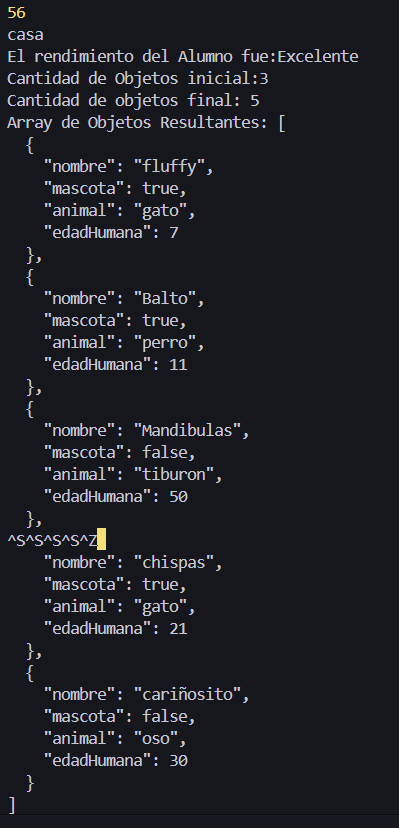

## Ejercicio de Comprbación Modulo 6 Sesión 1
### Escribe un ejemplo de código como los revisados anteriormente, utilizando funciones de callback, y determina el orden de ejecución (debes tener en cuenta que el código que recibe la función de callback puede tomar un tiempo determinado).

#### 1. **Ejemplos Funciones Callback**

1. **Define dos variables.**
   
2. **Muestra esas variables por consola usando “console.log()”.**
   
3.  **Define un método de ejemplo que realice una petición a una base de datos, e implementa el uso de una función de callback que muestre por consola la respuesta.**
   
4. **Puedes elegir cualquier orden para tus “console.log()”, luego de eso, especifica el orden en que se mostrarán por pantalla.**

 
#### 2. **Utilizando Objetos con NODE**

**Crearemos un programa de Node que pueda modificar una variable con contenido en formato json, añadiendo objetos, y luego contar la cantidad de objetos que guarda el Array.** 
**Variable inicial con Array de objetos:**

```javascript
//Variables Incial de objetos
var mascotasJson = [
     {
        "nombre": "fluffy",
        "mascota": true,
        "animal": "gato",
        "edadHumana": 7
    },
    {
        "nombre": "Balto",
        "mascota": true,
        "animal": "perro",
        "edadHumana": 11
    },
    {
        "nombre": "Mandibulas",
        "mascota": false,
        "animal": "tiburon",
        "edadHumana": 50
    }
]; 
```
1. **Crea dos objetos en el mismo formato que presentan los que están contenidos en el Array de la variable inicial, guarda cada uno en una variable distinta, y luego utiliza el método push de JavaScript para añadirlos a la variable inicial.**
   
2. **Imprime por consola la cantidad inicial de objetos del Array con el mensaje: “Cantidad de objetos inicial: número”, y la cantidad final luego de agregarle los nuevos objetos creados por ti, con el mensaje “Cantidad de objetos final: número”. Por último, imprime por consola el Array de objetos resultante de tus modificaciones.**

## 1. **Solucion: Ejemplos Funciones Callback.**

-  **Primero, definiremos dos variables: numero y palabra**
  
    ```javascript
    //Definicion de las Variables 
    const numero = 56;
    const palabra = 'casa';
    ```

- **A continuación, creamos la función obtenerRendimientoAlumno, que acepta dos parámetros: idAlumno y callback. Esta función simula una petición a una base de datos usando setTimeout(), para introducir un retraso de 2 segundos antes de ejecutar la función callback.**
  
    ```javascript 
    //Ejemplo de una función que simula una petición a una base de datos  con callback
    function obtenerRendimientoAlumno(idAlumno, callback) {
        //Simulamos una operación asíncrona con SetTimeout
        setTimeout(() => {
            const rendimiento = 'Excelente'; //Simulación de un resultado de la base de datos 
            callback(rendimiento); // llamada a la función callback con el resultado
        }, 2000) //Simula un retraso de 2 segundos en la petición
    }
    ```
- **En el siguiente fragmento de código, se ejecuta la función obtenerRendimientoAlumno y se muestran en consola tanto las variables definidas como el resultado de la función. El propósito es observar el orden en que se muestra cada elemento y entender cómo se manejan las tareas asíncronas en Node.js.**
  
    ```javascript
    obtenerRendimientoAlumno(1, function (rendimiento) {
        console.log('El rendimiento del Alumno fue:' + rendimiento);
    });
    console.log(numero);
    console.log(palabra);
  
    ``` 
- **Obteniendo en consoloa el siguiente orden:**
  - 56
  - casa
  - El rendimiento del Alumno fue:Excelente

- **Este ejercicio ilustra el funcionamiento del código asíncrono en Node.js. Cuando se realiza una petición o consulta, como la simulada con setTimeout, Node.js no bloquea la ejecución del resto del código. En lugar de esperar a que la operación asíncrona termine, Node.js continúa ejecutando el código siguiente y maneja la operación en segundo plano. Una vez que la operación se completa, la función callback se ejecuta.**
  
- **Este modelo de programación permite que los programas manejen múltiples tareas de manera eficiente sin afectar la performance general, ya que Node.js se encarga de apilar y ejecutar las tareas pendientes en su Event Loop. Esto hace que el manejo de operaciones asíncronas sea más ágil y eficaz.**

## 2. **Utilizando Objetos con NODE.**

- **Primero creamos dos objetos almacenados en variables distintas con el mismo formato que presenta el array de objetos `mascotasJson` :**

    ```javascript
    //Mascota 1
    var mascota1 = 
        {
            "nombre": "chispas",
            "mascota": true,
            "animal": "gato",
            "edadHumana": 21
        };
        
    //Mascota 2
    var mascota2 = 
        {
            "nombre": "cariñosito",
            "mascota": false,
            "animal": "oso",
            "edadHumana": 30
        };
    ```
- **Utilizamos el metodo propio de arrays push, para agregar los dos nuevos objetos al array `mascotasJson`:**
  
    ```javascript
    // Agregamos las nuevas mascotas al array
    mascotasJson.push(mascota1);
    mascotasJson.push(mascota2);
    ```
- **en consola imprimimos la cantidad incial de objetos en el array `mascotasJson`:**
  
    ```javascript
    //Contamos la cantidad Inicial de Objetos 
    console.log('Cantidad de Objetos inicial:' + mascotasJson.length);
    ```

- **Luego la cantidad final de objetos en el array `mascotasJson`, después de haber agregado los nuevos objetos creados:**
 
    ```javascript
    console.log('Cantidad de objetos final: ' + mascotasJson.length);
    ```

- **Mostramos el estado final del array  `mascotasJson` producto de nuestras modificaciones**:
  
    ```javascript 
    //Mostrar el Array Actualizado en formato JSON
    console.log('Array de Objetos Resultantes: ' + JSON.stringify(mascotasJson, null, 2));
    ```
- **Resultado Final**
  
    